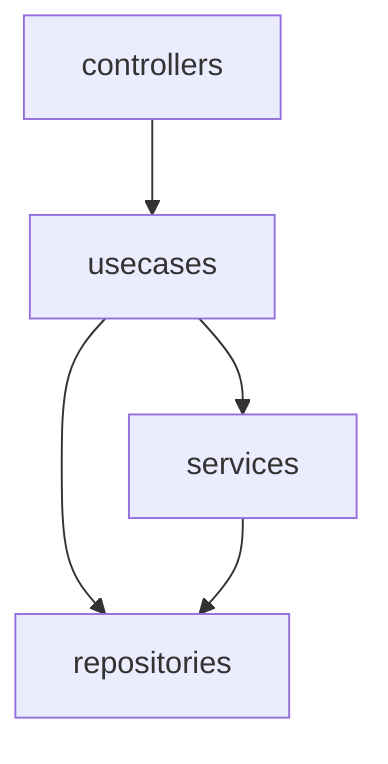

# Trying out ts-arch usage.

Test the dependencies of files configured with the following naming conventions.
The test uses UML and [ts-arch](https://github.com/ts-arch/ts-arch) Slices API.

```sh
src/
├── pet
│   ├── pet.controller.ts
│   ├── repositories
│   │   └── pet.repository.ts
│   ├── services
│   │   └── pet.service.ts
│   └── usecases
│       └── pet.usecase.ts
└── tests
    ├── architecture.puml
    └── architecture.test.ts
```

## Dependencies



## Run test

```sh
npm run test
```

## Slices API example

```typescript
describe('architecture test', () => {
  it('should match uml and dependency', async () => {
    const graph = await extractGraph()
    const mapFunction = sliceByFileSuffix(
      new Map([
        ['controller', 'controllers'],
        ['usecase', 'usecases'],
        ['service', 'services'],
        ['repository', 'repositories'],
      ])
    )
    const reducedGraph = projectEdges(graph, mapFunction)
    const stringDiagram = exportDiagram(reducedGraph)
    const actualDiagram = parse(stringDiagram)
    expect(actualDiagram[0]).toHaveProperty('elements')

    const umlPath = path.resolve(__dirname, 'architecture.puml')
    const umlDiagram = fs.readFileSync(umlPath, 'utf8')
    const expectedDiagram = parse(umlDiagram)
    expect(expectedDiagram[0]).toHaveProperty('elements')

    expect(actualDiagram[0].elements)
    .toEqual(expect.arrayContaining(expectedDiagram[0].elements))
  })
})

```
